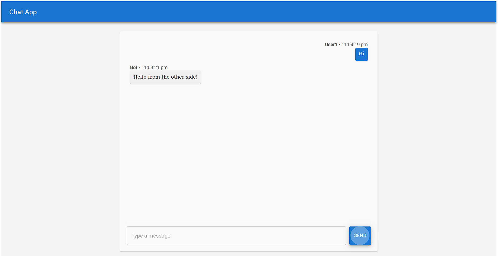

# Responsive Chat Application

A fully responsive chat interface built using **React**, **Vite**, **Material-UI (MUI)**, and **Redux Toolkit**. This project implements a simple chat UI where users can send and receive messages, with state management provided by Redux Toolkit.

## Features

- **Responsive Design**: The chat interface adjusts to various screen sizes and is centered on the screen for an optimal user experience.
- **Message Input and Send**: Users can type messages and send them via a button.
- **Chat Display**: Messages are displayed in a scrollable chat window with timestamps for each message.
- **Auto-Scroll**: The chat window scrolls automatically to the latest message.
- **Simulated Message Reception**: Messages are simulated after a delay to demonstrate real-time chat functionality.
- **State Management**: Managed using Redux Toolkit, ensuring clean and organized state for messages and user information.
- **Material-UI Components**: Styled using MUI components for a modern, consistent UI.


## Tech Stack

- **React 18**: Used for building the UI and managing the component lifecycle.
- **Vite**: A fast build tool used to bundle and run the project.
- **Material-UI (MUI)**: For consistent and responsive UI components.
- **Redux Toolkit**: For state management, handling chat messages and user data.
- **JavaScript (ES6+)**: Core language for all functionality.

## Installation & Setup

Follow these steps to get the project running locally:

1. **Clone the repository**:
    ```bash
    git clone https://github.com/yash08123/Chat-App-MUI.git
    ```


2. **Install dependencies**:
    ```bash
    npm install
    ```

3. **Run the development server**:
    ```bash
    npm run dev
    ```

4. **Access the application**:
   - Open your browser and go to `http://localhost:5173/` to view the chat application.

## Usage

1. Type your message in the input field at the bottom of the chat window.
2. Click the "Send" button or press "Enter" to send the message.
3. Messages will appear in the chat window, and you'll receive a simulated reply after a short delay.

## Screenshots

### Chat UI with Message List and Input Field



## Learn More

To learn more about the technologies used in this project, visit the following documentation:

- [React Documentation](https://reactjs.org/docs/getting-started.html)
- [Vite Documentation](https://vitejs.dev/guide/)
- [Material-UI Documentation](https://mui.com/material-ui/getting-started/installation/)
- [Redux Toolkit Documentation](https://redux-toolkit.js.org/introduction/getting-started)

